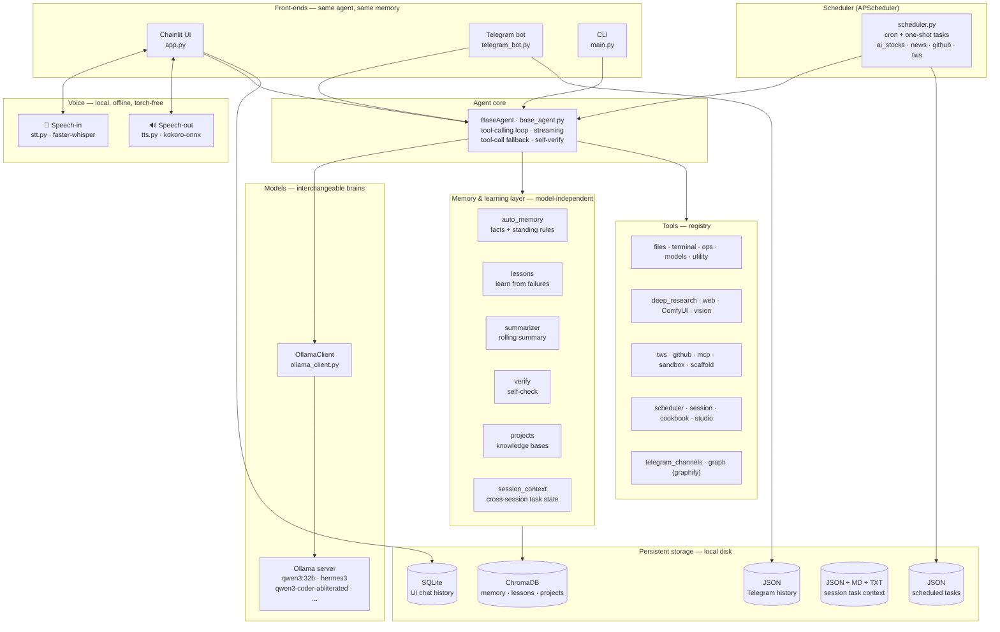
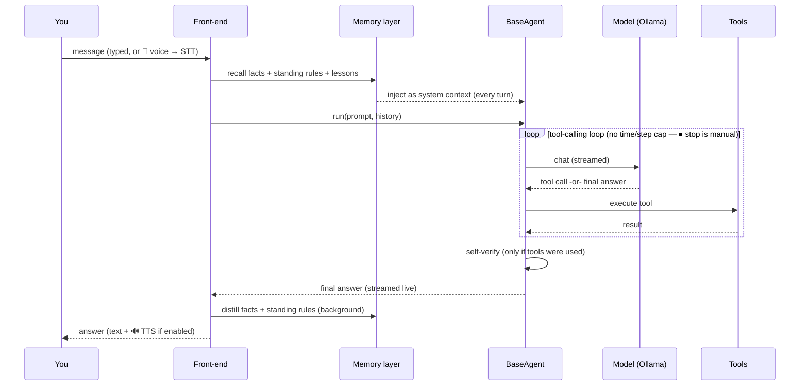
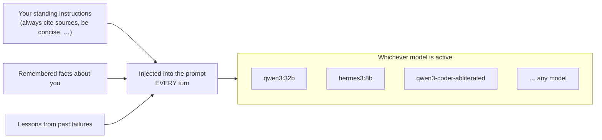

# Zero Agent — Architecture

A visual map of how the system fits together. Open this file's **Markdown
Preview** in VS Code (or view on GitHub) to render the Mermaid diagrams.

> **Key idea:** the model is just an interchangeable *brain*. The memory &
> learning layer, the tools, and the voice I/O all wrap **every** model — so your
> standing instructions, remembered facts, and lessons apply no matter which
> model is active. The preferences are the **agent's**, not the model's.

---

## High-level components

---

## What happens in one turn

---

## Why the model is "just a brain"

The grey box swaps freely; everything feeding into it stays the same. That is why
feedback you give under one model is honoured by **all** of them — only how
*precisely* a model follows the instructions varies with the model's quality.

---

## Module map (where things live)

| Area | Files |
|------|-------|
| Front-ends | `app.py` (Chainlit UI), `telegram_bot.py` (+ file upload to projects), `main.py` (CLI) |
| Agent core | `orchestrator/agents/base_agent.py` |
| Model client | `orchestrator/models/ollama_client.py` |
| Voice | `orchestrator/stt.py` (in), `orchestrator/tts.py` (out) |
| Memory & learning | `orchestrator/auto_memory.py`, `lessons.py`, `summarizer.py`, `verify.py`, `projects.py` |
| Memory hygiene | `orchestrator/memory_guard.py` (dedup/contradiction), `orchestrator/memory_hygiene.py` (TTL/decay), `orchestrator/idle_hygiene.py` |
| Cross-session context | `orchestrator/session_context.py`, `orchestrator/tools/session_tools.py` |
| Self-improvement | `orchestrator/self_improve.py` (rule extraction from failures) |
| Scheduler | `orchestrator/scheduler.py` (APScheduler cron/one-shot), `orchestrator/tools/scheduler_tools.py` |
| Vector store | `orchestrator/memory/store.py` (ChromaDB) |
| Notifications | `orchestrator/notify.py` (Windows toast — HITL), `orchestrator/telegram_notify.py` (send_to_owner) |
| Telegram reading | `orchestrator/telegram_reader.py` (Telethon MTProto), `orchestrator/tools/telegram_channel_tools.py` |
| TWS trading | `orchestrator/tools/tws_tools.py` — launch + WM_CHAR auto-login + status + stop |
| GitHub | `orchestrator/tools/github_tools.py` — trending repos + repo info |
| MCP | `orchestrator/mcp_client.py`, `orchestrator/tools/mcp_tools.py` — Model Context Protocol |
| Sandbox | `orchestrator/tools/sandbox_tools.py` — Docker isolated execution |
| Project scaffolding | `orchestrator/tools/scaffold_tools.py` — Python / Node / Android starter projects |
| Cookbook | `orchestrator/cookbook.py`, `orchestrator/tools/cookbook_tools.py` — reusable agent recipes |
| Studio / media | `orchestrator/tools/studio_tools.py` — ComfyUI video/audio/SVD |
| Graph (graphify) | `orchestrator/tools/graph_tools.py` — knowledge graph per project + system-wide merge |
| API guard | `orchestrator/api_guard.py` — prevent silent public-API breakage on rewrites |
| Tools registry | `orchestrator/tools/` — all tools auto-registered via `@registry.register` |
| Persistence | `orchestrator/persistence.py` (SQLite), `telegram_history.py` (JSON), `data/` (tasks + session) |
| Config | `orchestrator/config.py` (all settings, env-overridable) |

See [ROADMAP.md](ROADMAP.md) for status and [CHANGELOG.md](CHANGELOG.md) for the
dated history of changes.
