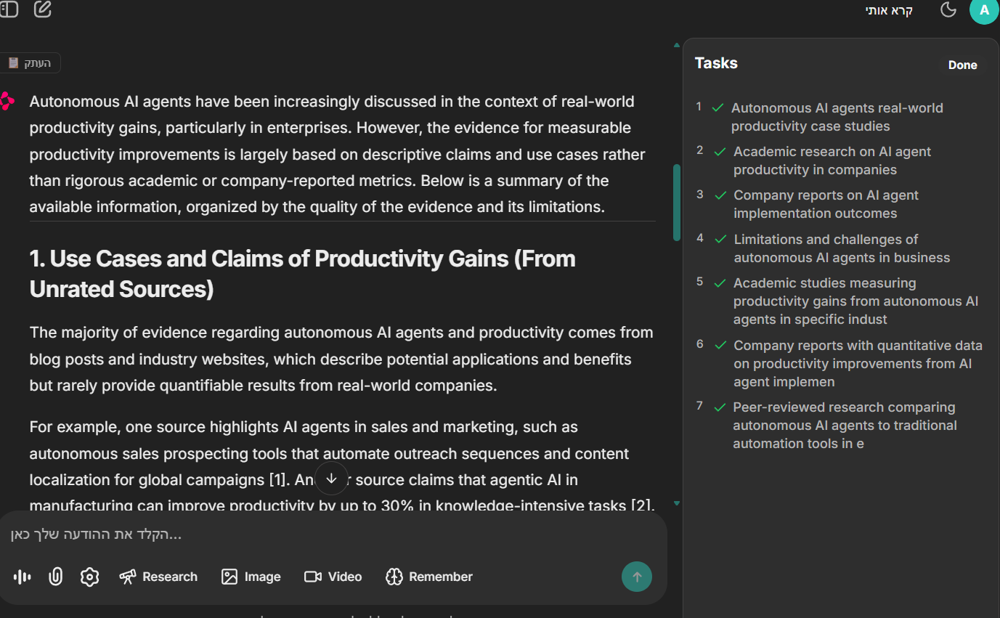
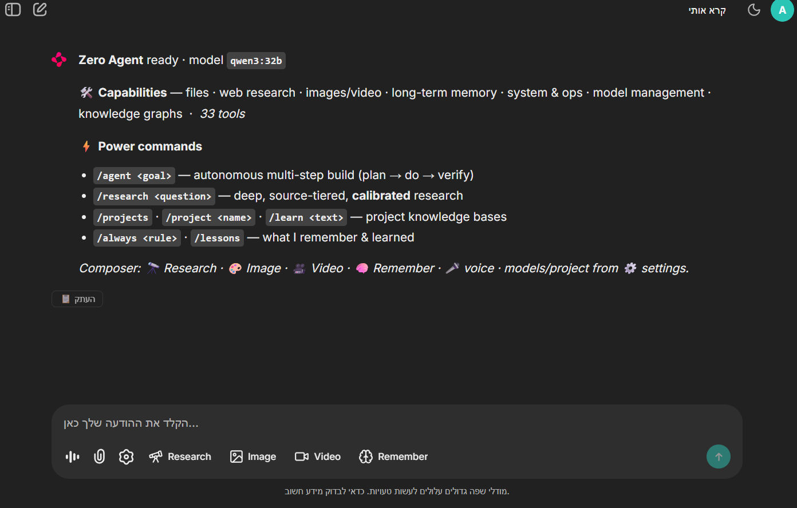

# 🤖 Zero Agent


[](https://github.com/shkomig/Zero_agent_2026/actions/workflows/ci.yml)
[](https://github.com/shkomig/Zero_agent_2026/stargazers)

> A **100% local**, autonomous AI agent — no cloud, no API keys. It plans,
> builds, researches, verifies its own work, and learns from its mistakes,
> running entirely on your machine against a local [Ollama](https://ollama.com)
> server.



> `/research` running **iterate-until-confident**: the question is decomposed into
> sub-queries, each searched and verified live (the **Tasks** panel), then
> synthesized with **source-tier calibration** — note the report organizing
> evidence *by quality* and flagging "Unrated Sources" instead of over-claiming.

<details><summary>📸 More — the welcome screen</summary>



</details>

Zero is a personal AI workspace: a single tool-calling agent with ~33 tools, a
multi-step **Supervisor-Worker** planner, an **iterative, calibrated research**
engine, long-term vector memory, local voice, and a Human-in-the-Loop safety gate
— across a Chainlit web UI, a CLI, and a Telegram bridge.

---

## ✨ Highlights

- **🧠 Autonomous builds** — `/agent <goal>`: a Supervisor plans the goal into
  steps, a Worker executes each, and a **RealityVerifier** checks the result is
  *actually* on disk (compiles / exists) before calling it done — no "claimed
  success" hallucinations. Retries and replans on failure.
- **🔬 High-grade research** — `/research <question>`: iterate-until-confident
  (decompose → search → assess gaps → search more), every web source tagged
  **PRIMARY / REPUTABLE / SECONDARY / UNRATED**, and a synthesis **calibrated to
  provenance** with a faithfulness pass. Inspired by DeepWeb-Bench's emphasis on
  cross-source evidence and evidence-matched confidence — done locally.
- **🛡️ Safety built in** — Human-in-the-Loop approval before destructive tools
  (delete / shell / launch / download), prompt-injection fencing of untrusted web
  content, a shell deny-list, and Pydantic-validated tool arguments.
- **📚 Memory & learning** — ChromaDB vector memory, auto-recalled facts +
  standing rules + lessons-from-mistakes injected each turn. ChatGPT-style
  Projects.
- **🗺️ Knowledge graphs** — `graphify_project(path)`: turn any local project into
  a navigable knowledge graph, 100% locally.
- **🔊 Local voice** — Kokoro TTS out + faster-whisper STT in, torch-free, off the
  LLM's VRAM.
- **🎨 Media** — local image/video generation via ComfyUI; local vision.
- **🔌 100% local** — your data, prompts, and chats never leave the machine.

---

## 🚀 Quick start

**Prerequisites:** Python 3.12+, a running [Ollama](https://ollama.com) with a
tool-capable model, and (optional) [ComfyUI](https://github.com/comfyanonymous/ComfyUI).

```bash
ollama serve
ollama pull qwen3:32b           # default brain

git clone https://github.com/shkomig/Zero_agent_2026.git
cd Zero_agent_2026
python -m venv .venv
.venv\Scripts\pip install -r requirements.txt
```

**Run** (Windows, one click): `START_ALL.bat` — starts Ollama + ComfyUI + the UI,
then open **http://localhost:8000** (local login `admin` / `zero`).
Or directly: `chainlit run app.py`.

```text
/agent <goal>        build something autonomously (plan → do → verify)
/research <question> deep, source-tiered, calibrated research
/projects            named, persistent knowledge bases
/always · /lessons   what the agent remembers and has learned
```

For Telegram, copy `.env.example` → `.env` and add your bot token.

---

## 📖 Documentation & architecture

Full architecture, tool reference, configuration, and safety model:
**[orchestrator/README.md](orchestrator/README.md)** · changelog:
**[CHANGELOG.md](CHANGELOG.md)** · roadmap: **[ROADMAP.md](ROADMAP.md)**.

```
Entry points (app.py · main.py · telegram_bot.py)
        │
   BaseAgent (tool loop) ── Supervisor (/agent) ── ResearchAgent (/research)
        │
   ToolRegistry ── tools/*  ◄──►  OllamaClient ──► Ollama :11434
```

---

## 🔒 Privacy

Everything runs locally. Your `.env` (secrets) and `data/` (chat history, memory,
outputs) are git-ignored and never published. Treat the agent as a **privileged
local process** — it can read/write files and run shell commands (gated by HITL).

---

## 🛠️ Status

Active development. Built and dog-fooded on a single RTX-class GPU. Contributions,
issues, and ⭐ stars welcome — if Zero is useful to you, a star helps others find it.

## 📜 License

[MIT](LICENSE) — free to use, modify, and distribute. Contributions are welcome
under the same license; open an issue or PR.
